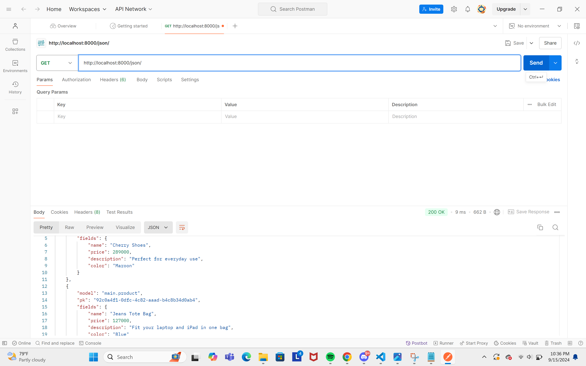
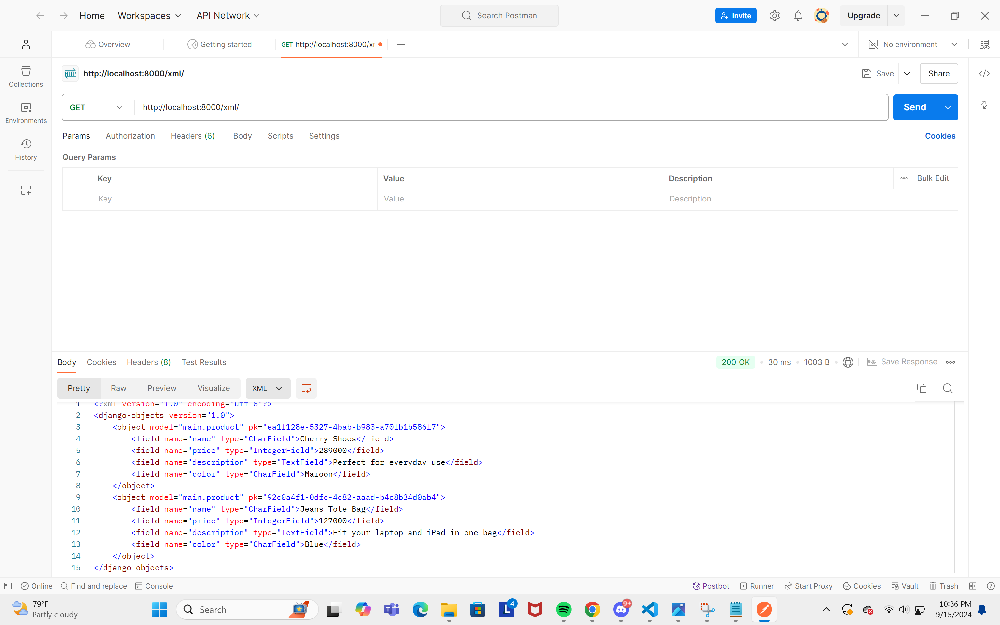
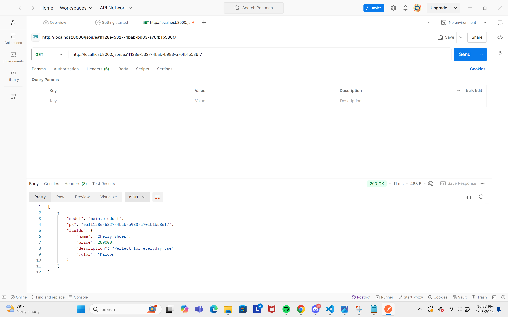
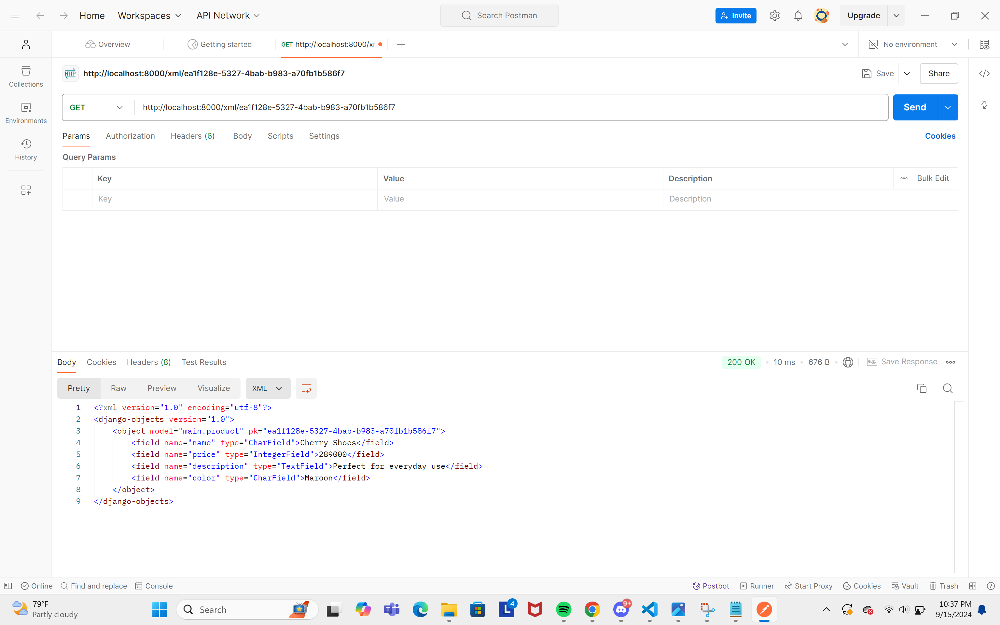

**URL of PWS Deployment:**

http://rayienda-hasmaradana-cherrystore.pbp.cs.ui.ac.id/

Questions and Answers
1. Explain how you implemented the checklist above step-by-step (not just following the tutorial)

**Project Implementation**

Creating a new Django project
- made a new directory `cherry-shop` for this project.
- activated virtual environment on the directory `cherry-shop` to avoid Python version conflicts with the command:

```
env\Scripts\activate
```

- made a new file `requirements.txt` and filled it with the following:
```
django
gunicorn
whitenoise
psycopg2-binary
requests
urllib3
```
and installed them with:
```
pip install -r requirements.txt
```

- Initialized the project with:
```
django-admin startproject cherry_shop .
```

- after the project is installed, I added `"localhost"` and `"127.0.0.1"` as a part of the list `ALLOWED_HOST` in the file `settings.py`


- Creating an application `main` in the project

- Made a new app `main` with command:
```
python manage.py startapp main
```
- Make the Template

After the app main is installed, I added `main` to the `INSTALLED_APPS` in the file `settings.py`.

- Made a new directory `template` inside the directory `main` and created a new file `main.html` as a template, and filled `main.html` with placeholder fields `{{ application_name }}`, `{{ name }}`, and `{{ class }}` where the context will be later provided by `views.py`.

- Made the model Product in `models.py` with the attributes name, price, and description.

```
from django.db import models

class Product(models.Model):
    name = models.CharField(max_length=255)
    price = models.IntegerField()
    description = models.TextField()
```

- After the main HTML is done, I created a function `show_main` in `views.py` that will give back response as an HTML template that shows the name of the application, my name, and class.

```
from django.shortcuts import render

def show_main(request):
    context = {
        'application_name': 'cherry-shop',
        'class': 'PBD KKI',
        'name': 'Rayienda Hasmaradana',
    }

    return render(request, "main.html", context)
```
URL Configuration
- Made the file `urls.py` on the directory `main` for routing the `show_main` function in `views.py` to `urls.py` and filled it with:
```
from django.urls import path
from main.views import show_main

app_name = 'main'

urlpatterns = [
    path('', show_main, name='show_main'),
]
```

- Then configured `urls.py` on the directory `cherry_shop` and filled with:
```
from django.contrib import admin
from django.urls import path, include


urlpatterns = [
    path('admin/', admin.site.urls),
    path('', include('main.urls')),

]
```
Git & PWS Deployment
- Made a new repository in github and connect it with my local repository.
- After connected, I did the command `add`, `commit` and `push` to push the changes to the remote repository.
- For deploying to PWS, I created a new PWS project named `cherrystore`, then added this to the list `ALLOWED_HOST`:
```
ALLOWED_HOSTS = ["localhost", "127.0.0.1", "rayienda-hasmaradana-cherrystore.pbp.cs.ui.ac.id"]
```
and push to PWS repository for the deployment.

2. Create a diagram that contains the request client to a Django-based web application and the response it gives, and explain the relationship between urls.py, views.py, models.py, and the html file.


3. The use of git in software development

Git works as the Version Control System that allows developers to track every changes in their code, and allows them to store their projects in remote repositores such as Github or Gitlab, developers can also collaborate with other developers as a team in the same project.

4. Why is Django used as the starting point for learning software development?

Because django supports rapid development and follows practices like the MVT architecture. It allows beginner developers to understand fundamental concepts like routin, templating, and database management without having to worrying about more codes. Django also has large and well-organized documentation, making it easier for beginners to find information and learn how to use the framework effectively. 

5. Why is the Django model called an ORM?

Because they map python objects to relational database, providing an abstraction layer that simplifies database interaction. ORM abstracts interactions with the database, making it easier to manage data and keeping code consistent and easy to understand.


## Assignment 3 - PBD
---
 ### Explain why we need data delivery in implementing a platform.
 Data delivery is important because it supports accurate and timely information flow accross many components of the platform. This improves the platform's functionality and user experience while enabling real-time interaction and decision-making. The platform won't be able to function optimally without it, because the data needed to perform various operations cannot be exchanged properly.

 ### In your opinion, which is better, XML or JSON? Why is JSON more popular than XML?
 In my opinion, JSON is better, also it is more popular than XML because of its efficiency compared to XML. JSON also has simpler syntax, and JSON is integrated with JavaScript, making it to easier to implement on web applications.

 ### Explain the functional usage of is_valid() method in Django forms. Also explain why we need the method in forms.
 `is_valid()` in Django is used to validate data thats included in the form. This method checks if the data submitted by user is according to the validation in the form. If it is valid it will give the result `True` and process the data, if not it will give back `False` and user will get an error message. Without the method `is_valid()`, we won't be able to make sure the data received is safe and according to the rules that's created. It is important for maintaining data integrity and application security.

 ### Why do we need csrf_token when creating a form in Django? What could happen if we did not use csrf_token on a Django form? How could this be leveraged by an attacker?
 `csrf_token` is used to protect web applications from CSRF (Cross-Site Request Forgery) attacks. CSRF attacks occur when an attacker sends a malicious request to the server on behalf of an authenticated user. If we don't add `csrf_token` to the Django form, an attacker could create a script/link that automatically sends a request to our server by exploiting the credentials of the active user. Without this token, the server cannot verify whether the request received comes from a legitimate source, allowing the attacker to perform unwanted actions on behalf of that user, such as changing data or making unauthorized transactions.

 ### Explain how you implemented the checklist above step-by-step (not just following the tutorial).
 

- Create a form that can receive new datas

```python
# forms.py
from django.forms import ModelForm
from main.models import Product

class ShopEntryForm(ModelForm):
    class Meta:
        model = Product
        fields = ["name", "price", "description", "color"]
```

Add an UUID to the model to correctly identify each `Product` model

```python
# models.py
class Product(models.Model):
    id = models.UUIDField(primary_key=True, default=uuid.uuid4, editable=False)
```

- Add a URL path for Form

```python
# urls.py
from django.urls import path

urlpatterns = [
    path('create-product-entry', create_product_entry, name='create_product_entry'),
]
```

- Create an HTML template to show form:
```html
<!-- create_product_entry.html -->
 

<h1>Add New Product</h1>

<form method="POST">
  
  <table>
    {{ form.as_table }}
    <tr>
      <td></td>
      <td>
        <input type="submit" value="Add Product" />
      </td>
    </tr>
  </table>
</form>


```
```html
<!-- main.html -->

<p>There are no products in cherry store.</p>

<table>
  <tr>
    <th>Product Name</th>
    <th>Price</th>
    <th>Description</th>
    <th>Color</th>
  </tr>

   This is how to display product
   
  
  <tr>
    <td>{{product_entry.name}}</td>
    <td>{{product_entry.price}}</td>
    <td>{{product_entry.description}}</td>
    <td>{{product_entry.color}}</td>
  </tr>
  
</table>


<br />

<a href="">
  <button>Add New Product</button>
</a>

```
```python
# views.py
def show_main(request):
    shop_entry = Product.objects.all()
    context = {
        'application_name': 'cherry-shop',
        'class': 'PBD KKI',
        'name': 'Rayienda Hasmaradana',
        'product_entries' : shop_entry
    }

    return render(request, "main.html", context)
```

Then create a View to show and process input form

```python
# views.py
def create_product_entry(request):
    form = ShopEntryForm(request.POST or None)

    if form.is_valid() and request.method == "POST":
        form.save()
        return redirect('main:show_main')

    context = {'form': form}
    return render(request, "create_product_entry.html", context)
```

- Adding 4 Views Function to View Object in XML and JSON Format

View for XML:

```python
from django.http import HttpResponse
from django.core import serializers

def show_xml(request):
    data = Product.objects.all()
    return HttpResponse(serializers.serialize("xml", data), content_type="application/xml")
```

View for JSON:

```python
from django.http import HttpResponse
from django.core import serializers

def show_json(request):
    data = Product.objects.all()
    return HttpResponse(serializers.serialize("json", data), content_type="application/json")
```

View for XML by ID:

```python
def show_xml_by_id(request, id):
    data = Product.objects.filter(pk=id)
    return HttpResponse(serializers.serialize("xml", data), content_type="application/xml")
```

View for JSON by ID:

```python
def show_json_by_id(request, id):
    data = Product.objects.filter(pk=id)
    return HttpResponse(serializers.serialize("json", data), content_type="application/json")
```

- Make a routing for each views:
Add a URL Routing for each views in the format JSON and XML to `urls.py`:

```python
from django.urls import path
from main.views import show_main, create_product_entry, show_xml, show_json, show_xml_by_id, show_json_by_id
app_name = 'main'

urlpatterns = [

#URL for XML and JSON
    path('xml/', show_xml, name='show_xml'),
    path('json/', show_json, name='show_json'),

#URL for XML and JSON by ID
    path('xml/<str:id>/', show_xml_by_id, name='show_xml_by_id'),
    path('json/<str:id>/', show_json_by_id, name='show_json_by_id'),

]
```

Accessing the four URLs by using Postman:
**JSON**
 

**XML**


**JSON by ID**


**XML by ID**
