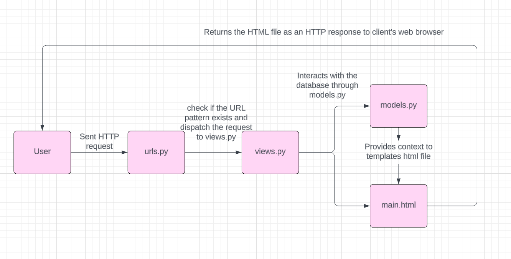

**URL of PWS Deployment:**

http://rayienda-hasmaradana-cherrystore.pbp.cs.ui.ac.id/

Questions and Answers
1. Explain how you implemented the checklist above step-by-step (not just following the tutorial)

**Project Implementation**

Creating a new Django project
- made a new directory `cherry-shop` for this project.
- activated virtual environment on the directory `cherry-shop` to avoid Python version conflicts with the command:

```
env\Scripts\activate
```

- made a new file `requirements.txt` and filled it with the following:
```
django
gunicorn
whitenoise
psycopg2-binary
requests
urllib3
```
and installed them with:
```
pip install -r requirements.txt
```

- Initialized the project with:
```
django-admin startproject cherry_shop .
```

- after the project is installed, I added `"localhost"` and `"127.0.0.1"` as a part of the list `ALLOWED_HOST` in the file `settings.py`


- Creating an application `main` in the project

- Made a new app `main` with command:
```
python manage.py startapp main
```
- Make the Template

After the app main is installed, I added `main` to the `INSTALLED_APPS` in the file `settings.py`.

- Made a new directory `template` inside the directory `main` and created a new file `main.html` as a template, and filled `main.html` with placeholder fields `{{ application_name }}`, `{{ name }}`, and `{{ class }}` where the context will be later provided by `views.py`.

- Made the model Product in `models.py` with the attributes name, price, and description.

```
from django.db import models

class Product(models.Model):
    name = models.CharField(max_length=255)
    price = models.IntegerField()
    description = models.TextField()
```

- After the main HTML is done, I created a function `show_main` in `views.py` that will give back response as an HTML template that shows the name of the application, my name, and class.

```
from django.shortcuts import render

def show_main(request):
    context = {
        'application_name': 'cherry-shop',
        'class': 'PBD KKI',
        'name': 'Rayienda Hasmaradana',
    }

    return render(request, "main.html", context)
```
URL Configuration
- Made the file `urls.py` on the directory `main` for routing the `show_main` function in `views.py` to `urls.py` and filled it with:
```
from django.urls import path
from main.views import show_main

app_name = 'main'

urlpatterns = [
    path('', show_main, name='show_main'),
]
```

- Then configured `urls.py` on the directory `cherry_shop` and filled with:
```
from django.contrib import admin
from django.urls import path, include


urlpatterns = [
    path('admin/', admin.site.urls),
    path('', include('main.urls')),

]
```
Git & PWS Deployment
- Made a new repository in github and connect it with my local repository.
- After connected, I did the command `add`, `commit` and `push` to push the changes to the remote repository.
- For deploying to PWS, I created a new PWS project named `cherrystore`, then added this to the list 'ALLOWED_HOST':
```
ALLOWED_HOSTS = ["localhost", "127.0.0.1", "rayienda-hasmaradana-cherrystore.pbp.cs.ui.ac.id"]
```
and push to PWS repository for the deployment.

2. Create a diagram that contains the request client to a Django-based web application and the response it gives, and explain the relationship between urls.py, views.py, models.py, and the html file.



3. The use of git in software development

Git works as the Version Control System that allows developers to track every changes in their code, and allows them to store their projects in remote repositores such as Github or Gitlab, developers can also collaborate with other developers as a team in the same project.

4. Why is Django used as the starting point for learning software development?

Because django supports rapid development and follows practices like the MVT architecture. It allows beginner developers to understand fundamental concepts like routin, templating, and database management without having to worrying about more codes. Django also has large and well-organized documentation, making it easier for beginners to find information and learn how to use the framework effectively. 

5. Why is the Django model called an ORM?

Because they map python objects to relational database, providing an abstraction layer that simplifies database interaction. ORM abstracts interactions with the database, making it easier to manage data and keeping code consistent and easy to understand.